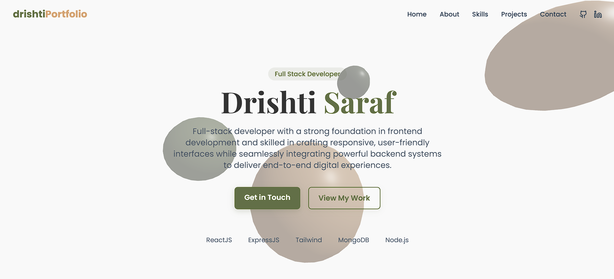

# 💼 [Drishti Saraf] - Developer Portfolio

Welcome to my personal developer portfolio! This site showcases my skills, projects, and professional journey as a "Full Stack Web Developer".

## 🌐 Live Website

👉 [View Portfolio](https://drishtisaraf.netlify.app/)

## 📸 Screenshots

## 🚀 Features

- ⚡ Clean, responsive UI built with [React/Vite/Next.js/etc.]
- 🌙 Dark/light theme toggle
- 🧠 Project showcase with detailed case studies
- 🛠️ Skills and tools section
- 📫 Contact form with email integration

## 🛠️ Built With

- React, Vite
- TailwindCSS
- Netlify, GitHub Pages

## 📁 Folder Structure

my-portfolio/
├── public/
├── src/
│ ├── assets/
│ ├── components/
│ ├── pages/
│ ├── styles/
│ └── utils/
├── .gitignore
├── package.json
└── README.md

## 🧑‍💻 Author

- Portfolio: [here](https://drishtisaraf.netlify.app/)
- GitHub: [@drishti1920](https://github.com/drishti1920)
- LinkedIn: [Drishti Saraf](https://www.linkedin.com/in/drishti-saraf)

## 📬 Contact

If you'd like to connect or work together, feel free to reach out via [drishtisaraf74@gmail.com](mailto:drishtisaraf74@gmail.com).

---

Thank you for checking out my portfolio! 😊
